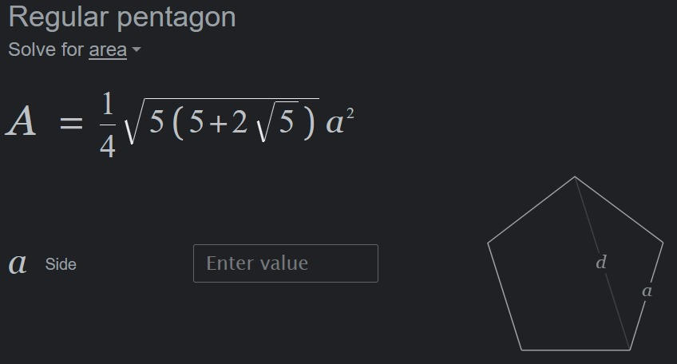
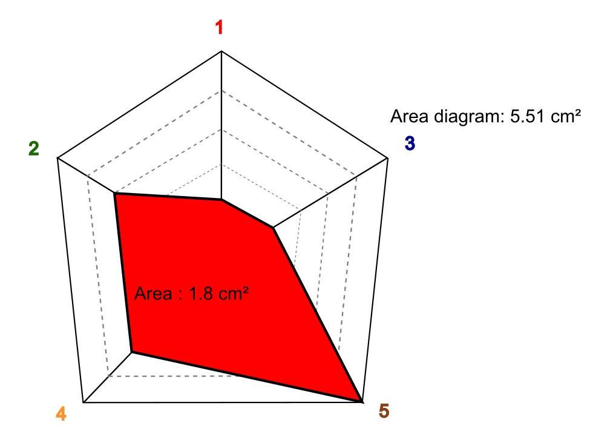

### Assignment_Phillip

Assignment(s):
- (1) Would it be possible to streamline the workflow of typting in the Name of a species into R, which then automatically extracts all the occurrences in GBIF, Downloads them and Maps them on a mal (regional, Continental and/or global map) and then runs a simple (!) SDM based on occupied niche to identify its suitable Habitat, then compute the AREA in km² of the currently occupied area and the AREA of the maximum suitable area? 
- (2) Could you theoretically write an R script that defines a shape (lets say pentagon) with a predetermined area (see Figure 1 below) and then maps another pentagon over it to estimate the % overlap (Ratio between star / Pentagon) where the shape of the Pentagon depends on the Dimension of each Corner of the Pentagon (see figure 2 below)

                                                                                    
 
