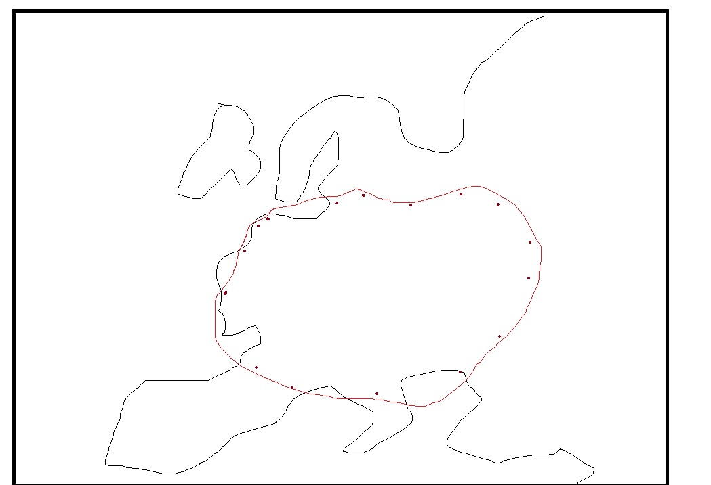
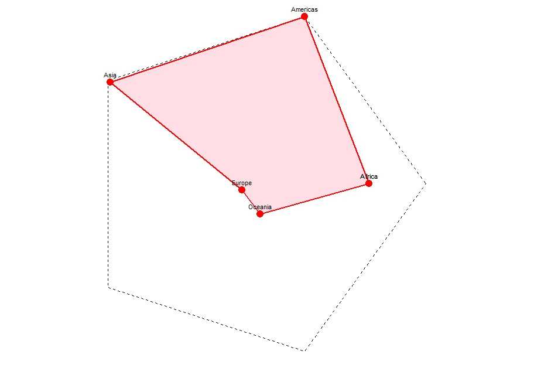

### Assignment_Phillip

Assignment(s):
- (1) Would it be possible to streamline the workflow of typting in the Name of a species into R, which then automatically extracts all the occurrences in GBIF, Downloads them and Maps them on a mal (regional, Continental and/or global map) and then runs a simple (!) SDM based on occupied niche to identify its suitable Habitat, then compute the AREA in km² of the currently occupied area and the AREA of the maximum suitable area?
  
  *Note:* for assignment #1 the Task would be to extract only those occurrence information that define the shape, like here the dark red spots
  
- (2) Could you theoretically write an R script that defines a shape (lets say pentagon) with a predetermined area (see Figure 1 below) and then maps another pentagon over it to estimate the % overlap (Ratio between star / Pentagon) where the shape of the Pentagon depends on the Dimension of each Corner of the Pentagon (see figure 2 below)

Extra notes:
**Note 1:** so if the species is everywhere in Germany but nowhere else, we would only Need the Points that define the shape of its presence, which woul then more or less overlap with Germanys shape
**Note 2:** If there were regions without it in Germany, like a hole, that would become more complex, but we could generalize it and assume its there as well or could be there as well

<table>
  <tr>
    <td>
      
    </td>
    <td>
      
    </td>
  </tr>
</table>

- ## Final result:

